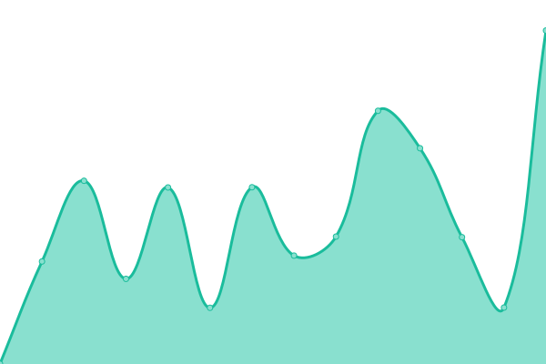
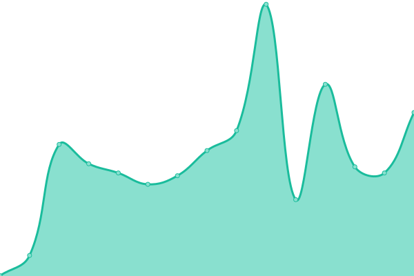
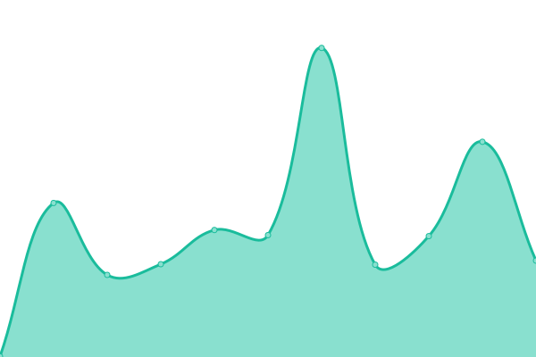
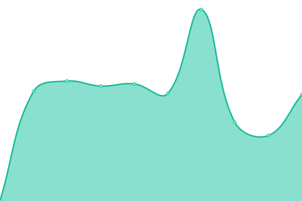
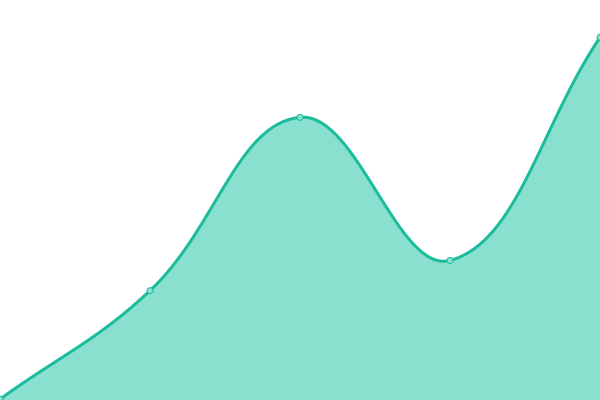

# [📈 Live Status](https://edisplay.github.io/check-status): <!--live status--> **🟧 Partial outage**

This repository contains the open-source uptime monitor and status page for [edisplay](https://www.linkedin.com/in/frcruz), powered by [Upptime](https://github.com/upptime/upptime).

With [Upptime](https://upptime.js.org), you can get your own unlimited and free uptime monitor and status page, powered entirely by a GitHub repository. We use [Issues](https://github.com/edisplay/check-status/issues) as incident reports, [Actions](https://github.com/edisplay/check-status/actions) as uptime monitors, and [Pages](https://edisplay.github.io/check-status) for the status page.

<!--start: status pages-->
<!-- This summary is generated by Upptime (https://github.com/upptime/upptime) -->
<!-- Do not edit this manually, your changes will be overwritten -->
<!-- prettier-ignore -->
| URL | Status | History | Response Time | Uptime |
| --- | ------ | ------- | ------------- | ------ |
|  [Blog04](https://blog04.mountsinai.org) | 🟥 Down | [blog04.yml](https://github.com/edisplay/check-status/commits/HEAD/history/blog04.yml) | 

 761ms
     
 | 

<a href="https://edisplay.github.io/check-status/history/blog04">100.00%</a>
    

|  [Blog05](https://blog05.mountsinai.org) | 🟩 Up | [blog05.yml](https://github.com/edisplay/check-status/commits/HEAD/history/blog05.yml) | 

 406ms
     
 | 

<a href="https://edisplay.github.io/check-status/history/blog05">100.00%</a>
    

|  [Blog06](https://blog06.mountsinai.org) | 🟩 Up | [blog06.yml](https://github.com/edisplay/check-status/commits/HEAD/history/blog06.yml) | 

 288ms
     
 | 

<a href="https://edisplay.github.io/check-status/history/blog06">100.00%</a>
    

|  [Blog07](https://blog07.mountsinai.org) | 🟩 Up | [blog07.yml](https://github.com/edisplay/check-status/commits/HEAD/history/blog07.yml) | 

 560ms
     
 | 

<a href="https://edisplay.github.io/check-status/history/blog07">100.00%</a>
    

|  [MSHS-APA](https://mshs-apa.mountsinai.org) | 🟩 Up | [mshs-apa.yml](https://github.com/edisplay/check-status/commits/HEAD/history/mshs-apa.yml) | 

 305ms
     
 | 

<a href="https://edisplay.github.io/check-status/history/mshs-apa">100.00%</a>
    

<!--end: status pages-->

[**Visit our status website →**](https://edisplay.github.io/check-status)

## 📄 License

- Powered by: [Upptime](https://github.com/upptime/upptime)
- Code: [MIT](./LICENSE) © [Anand Chowdhary](https://anandchowdhary.com), supported by [Pabio](https://pabio.com)
- Data in the `./history` directory: [Open Database License](https://opendatacommons.org/licenses/odbl/1-0/)
