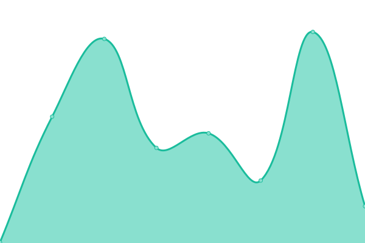

# [📈 Live Status](https://edisplay.github.io/check-status): <!--live status--> **🟩 All systems operational**

This repository contains the open-source uptime monitor and status page for [edisplay](https://www.linkedin.com/in/frcruz), powered by [Upptime](https://github.com/upptime/upptime).

With [Upptime](https://upptime.js.org), you can get your own unlimited and free uptime monitor and status page, powered entirely by a GitHub repository. We use [Issues](https://github.com/edisplay/check-status/issues) as incident reports, [Actions](https://github.com/edisplay/check-status/actions) as uptime monitors, and [Pages](https://edisplay.github.io/check-status) for the status page.

<!--start: status pages-->
<!-- This summary is generated by Upptime (https://github.com/upptime/upptime) -->
<!-- Do not edit this manually, your changes will be overwritten -->
<!-- prettier-ignore -->
| URL | Status | History | Response Time | Uptime |
| --- | ------ | ------- | ------------- | ------ |
|  [Mount Sinai](https://www.mountsinai.org) | 🟩 Up | [mount-sinai.yml](https://github.com/edisplay/check-status/commits/HEAD/history/mount-sinai.yml) | 

 521ms
     
 | 

<a href="https://edisplay.github.io/check-status/history/mount-sinai">100.00%</a>
    

|  [Icahn School of Medicine](https://icahn.mssm.edu) | 🟩 Up | [icahn-school-of-medicine.yml](https://github.com/edisplay/check-status/commits/HEAD/history/icahn-school-of-medicine.yml) | 

 387ms
     
 | 

<a href="https://edisplay.github.io/check-status/history/icahn-school-of-medicine">100.00%</a>
    

|  [NYEE](https://www.nyee.edu) | 🟩 Up | [nyee.yml](https://github.com/edisplay/check-status/commits/HEAD/history/nyee.yml) | 

 522ms
     
 | 

<a href="https://edisplay.github.io/check-status/history/nyee">100.00%</a>
    

|  [Mount Sinai Today](https://health.mountsinai.org) | 🟩 Up | [mount-sinai-today.yml](https://github.com/edisplay/check-status/commits/HEAD/history/mount-sinai-today.yml) | 

 821ms
     
 | 

<a href="https://edisplay.github.io/check-status/history/mount-sinai-today">100.00%</a>
    

|  [Mount Sinai Innovation Partners](https://ip.mountsinai.org) | 🟩 Up | [mount-sinai-innovation-partners.yml](https://github.com/edisplay/check-status/commits/HEAD/history/mount-sinai-innovation-partners.yml) | 

 1184ms
     
 | 

<a href="https://edisplay.github.io/check-status/history/mount-sinai-innovation-partners">100.00%</a>
    

<!--end: status pages-->

[**Visit our status website →**](https://edisplay.github.io/check-status)

## 📄 License

- Powered by: [Upptime](https://github.com/upptime/upptime)
- Code: [MIT](./LICENSE) © [Anand Chowdhary](https://anandchowdhary.com), supported by [Pabio](https://pabio.com)
- Data in the `./history` directory: [Open Database License](https://opendatacommons.org/licenses/odbl/1-0/)
